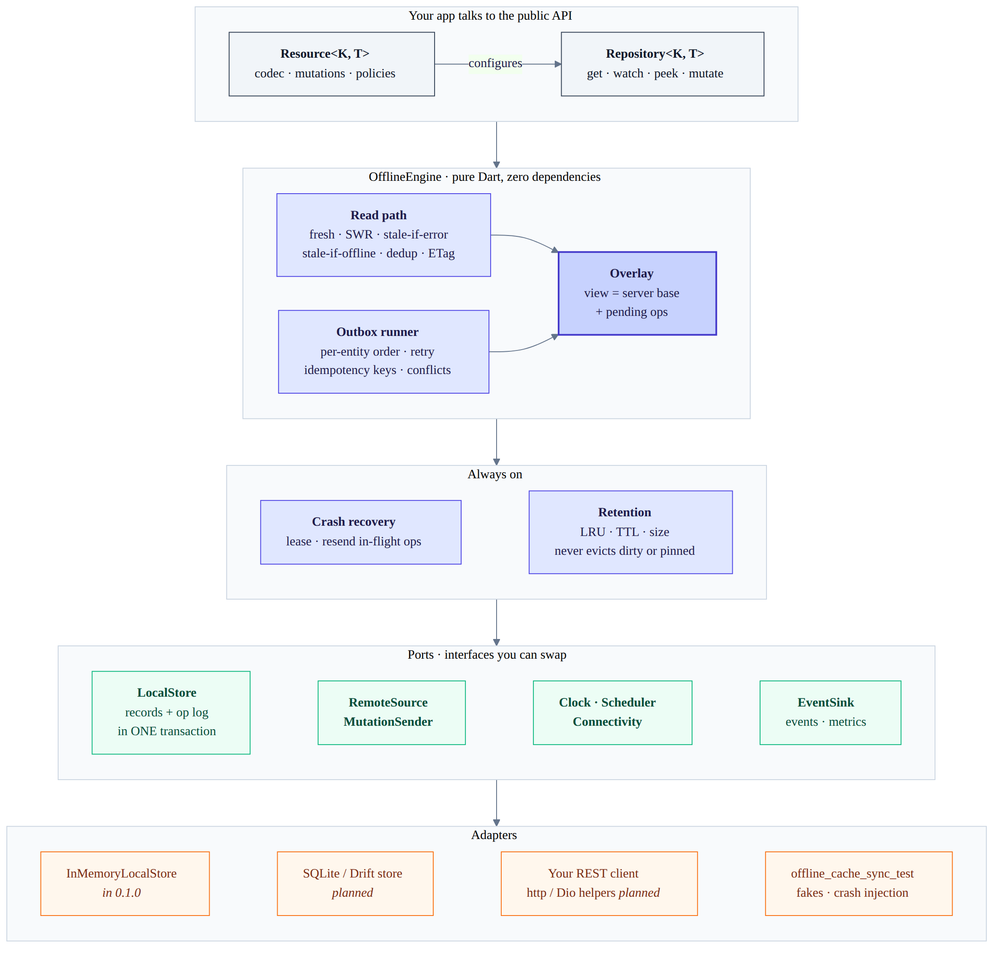

# offline_cache_sync (monorepo)

Offline-first data engine for Dart and Flutter. A durable outbox and a
stale-while-revalidate cache that agree with each other. See
[packages/offline_cache_sync/README.md](packages/offline_cache_sync/README.md).

## Architecture



Reads and writes both go through the **overlay**: the server-confirmed base plus the durable log of pending local ops. Refreshes replace only the base, and the outbox removes an op only once the server acknowledges it. Everything below the engine is a port, so storage and transport are swappable. The diagram source is [doc/architecture.mmd](doc/architecture.mmd).

| Package | What it is | Status |
| --- | --- | --- |
| [`offline_cache_sync`](packages/offline_cache_sync) | Pure-Dart core engine, zero runtime deps | 0.1.1 |
| [`offline_cache_sync_test`](packages/offline_cache_sync_test) | Fakes, crash injection, store conformance suite | 0.1.1 |
| [`offline_cache_sync_sqlite`](packages/offline_cache_sync_sqlite) | `LocalStore` on package:sqlite3 | 0.1.0 |
| `offline_cache_sync_drift` | `LocalStore` inside your Drift database | planned |
| `offline_cache_sync_http` / `_dio` | Conditional GETs, Idempotency-Key, If-Match, error classification | planned |
| `offline_cache_sync_flutter` | `OfflineScope`, `SnapshotBuilder`, `PendingBadge`, debug panel | planned |

## Develop

Requires Dart 3.6+ (pub workspaces).

```sh
dart pub get
dart analyze
(cd packages/offline_cache_sync && dart test)
(cd packages/offline_cache_sync_test && dart test)
(cd packages/offline_cache_sync_test && INVARIANT_RUNS=2000 dart test -t invariants)
```

## Release

```sh
./tool/release.sh            # all checks + dry run
./tool/release.sh --publish  # then publishes core, then the test kit
```

## Rules

- The core (`packages/offline_cache_sync/lib`) imports only `dart:async`, `dart:collection`, `dart:convert`, `dart:math` and `dart:typed_data`. `tool/check_core_imports.dart` enforces this in CI.
- Every storage adapter runs `runLocalStoreConformance` in its tests.
- Nothing is published unless the invariant suite passes.
